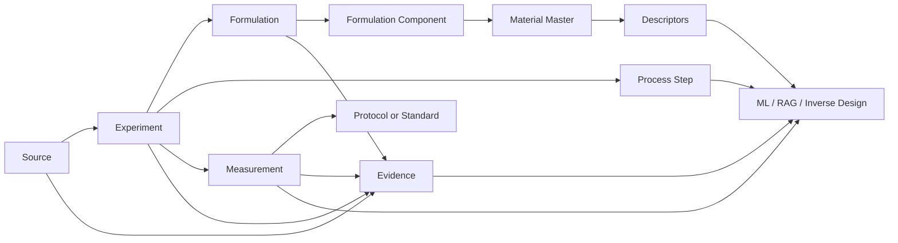

<h1 align="center">Database for PUR</h1>
<p align="center"><strong>Evidence-grounded knowledge base for PU / PUR / HMPUR research</strong></p>
<p align="center">Turning scattered PUR data from papers, theses, patents, standards and industrial documents into a searchable, traceable and model-ready research database.</p>
<p align="center"><strong>English</strong> · <a href="README.zh-CN.md">简体中文</a></p>

<p align="center">
  
</p>

<p align="center">
  <a href="data/materials/BATCH_005.md"></a>
  <a href="schema/pur_cn_v1.sql"></a>
  
  
</p>

<p align="center">
  <a href="#overview">Overview</a> ·
  <a href="#data-snapshot">Data Snapshot</a> ·
  <a href="#data-model">Data Model</a> ·
  <a href="#research-focus">Research Focus</a> ·
  <a href="#quick-start">Quick Start</a> ·
  <a href="#roadmap">Roadmap</a>
</p>

---

<a id="overview"></a>
## Overview

`Database-For-PUR` is a structured research database for **polyurethane and reactive polyurethane hot-melt adhesive (PUR/HMPUR)** research.

The project organizes public and user-owned data at experiment level:

**Source → Experiment → Formulation → Material → Process → Measurement → Standard → Evidence**

Primary uses include:

- formulation and process mining;
- SQL / FTS / vector retrieval;
- property prediction;
- formulation screening;
- inverse design;
- evidence-grounded scientific agents.

---

<a id="data-snapshot"></a>
## Data Snapshot

### Legacy HMPUR cloud base

The pre-existing HMPUR database contains:

| Data layer | Records |
|---|---:|
| Sources | **21** |
| Standardized formulations | **85** |
| Formulation components | **278** |
| Property / performance observations | **547** |
| Experimental protocols | **22** |
| Temperature-viscosity points | **4,559** |
| Descriptor records | **1,599** |
| PU Tg ML samples | **226** |

The legacy viscosity set contains **39 distinct PU prepolymer curves** over roughly 40–80 °C. A compact inventory is available in [`data/legacy/cloud_inventory.csv`](data/legacy/cloud_inventory.csv).

### Chinese structured corpus — Batch 004

| Data layer | Records |
|---|---:|
| Chinese sources | **36** |
| Experiments | **42** |
| Formulations | **41** |
| Formulation components | **252** |
| Process steps | **137** |
| Measurements | **131** |
| Protocol records | **29** |
| Evidence records | **58** |
| CN patents | **10** |
| MSc thesis index | **10** |
| Chinese standards | **8** |

<p align="center">
  
</p>

<p align="center">
  
</p>

### Batch 005 — raw-material descriptor layer

Batch 005 extends the database toward a **raw material → reaction → property** representation. Current additions include:

- Evonik DYNACOLL 7000 polyester-polyol descriptors;
- a controlled DYNACOLL + 4,4′-MDI RHM benchmark at OH:NCO = 1:2.2;
- Covestro Desmophen polyol descriptors;
- BASF Lupranate MDI / MDI-prepolymer descriptors;
- Stepan polyester polyols used in reactive hot-melt adhesive applications.

See [`data/materials/BATCH_005.md`](data/materials/BATCH_005.md).

---

<a id="data-model"></a>
## Data Model



Core tables include `sources`, `experiments`, `materials`, `formulations`, `formulation_components`, `process_steps`, `measurements`, `protocols`, `evidence`, `viscosity_curves`, `thesis_index`, and `standard_index`.

---

<a id="research-focus"></a>
## Research Focus

### Polyol blend → MDI prepolymer amplification

A central HMPUR hypothesis supported by this database is:

> Small property differences at the polyol-blend level may be systematically amplified after entering the MDI prepolymer stage, with the amplification itself depending on blend composition.

<p align="center">
  
</p>

Priority variables include `blend viscosity`, `prepolymer viscosity`, `NCO/OH`, `free NCO`, `OH value`, `acid value`, `Mn`, `polyol chemistry`, `reaction temperature`, `reaction time`, `DSC/crystallization`, `open time`, `green strength`, `peel`, and `lap shear`.

### Example composition-property trajectory

<p align="center">
  
</p>

For `CN_JRN_WANG2026_PAE`, increasing PAE from **0 to 10 wt.%** changes melt viscosity from **1292 to 4821 mPa·s**, NCO from **3.372 to 2.411 wt.%**, and open time from **4.5 to 11.3 min**.

### Mixing-law closure

```math
X_{blend} \rightarrow X_{prepolymer} \rightarrow Y_{adhesive}
```

```math
A = \frac{\Delta \eta_{prepolymer}}{\Delta \eta_{blend}}
```

### Evidence-constrained inverse design

```text
Target properties
        ↓
Material + composition + process descriptors
        ↓
Candidate ranking
        ↓
Experimentally testable PUR formulations
```

---

## Repository Structure

```text
Database-For-PUR/
├── README.md
├── README.zh-CN.md
├── assets/
├── data/
│   ├── cn/
│   ├── legacy/
│   ├── materials/
│   └── master/
├── schema/
│   └── pur_cn_v1.sql
├── scripts/
│   ├── build_database.py
│   └── validate_database.py
└── releases/
```

---

<a id="quick-start"></a>
## Quick Start

The current builder reconstructs the **core v1 database** from committed legacy metadata, the latest committed Chinese release, and transparent source deltas.

```bash
git clone https://github.com/stloendays/Database-For-PUR.git
cd Database-For-PUR
python scripts/build_database.py --output database/pur_master.db
python scripts/validate_database.py database/pur_master.db
```

Batch 005 raw-material CSVs are currently distributed as standalone datasets under `data/materials/` and are being integrated into the unified schema separately.

Example query:

```sql
SELECT source_id, formulation_id, sample_id,
       property_name_normalized, value, unit,
       temperature_c, evidence_type, quality_level
FROM measurements
WHERE property_name_normalized LIKE '%viscosity%'
  AND temperature_c BETWEEN 115 AND 125
ORDER BY value;
```

---

<a id="roadmap"></a>
## Roadmap

- [x] Legacy HMPUR inventory and migration base
- [x] PUR-CN relational schema
- [x] Chinese patent seed corpus
- [x] Quantitative Chinese journal extraction
- [x] MSc thesis index
- [x] Chinese test-standard layer
- [x] Raw-material Batch 005 seed
- [ ] Full 4,559-point legacy viscosity migration
- [ ] Integrate Batch 005 material tables into the unified schema
- [ ] Full thesis extraction where accessible
- [ ] Unified material descriptor layer
- [ ] Hybrid retrieval and ML-ready export
- [ ] Blend → prepolymer amplification dataset
- [ ] Evidence-constrained inverse-design benchmark

---

<p align="center"><strong>English</strong> · <a href="README.zh-CN.md">简体中文</a></p>
<p align="center"><strong>Database-For-PUR</strong><br><em>From scattered formulation evidence to machine-readable polyurethane design knowledge.</em></p>
