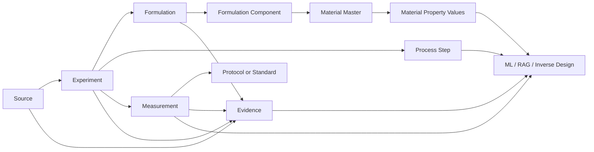

<h1 align="center">Database for PUR</h1>
<p align="center"><strong>Evidence-grounded knowledge base for PU / PUR / HMPUR research</strong></p>
<p align="center">Turning scattered PUR data from papers, theses, patents, standards and industrial documents into a searchable, traceable and model-ready research database.</p>
<p align="center"><strong>English</strong> · <a href="README.zh-CN.md">简体中文</a></p>

<p align="center">
  
</p>

<p align="center">
  <a href="data/materials/BATCH_005.md"></a>
  <a href="schema/pur_cn_v1.sql"></a>
  
  
</p>

<p align="center">
  <a href="#overview">Overview</a> ·
  <a href="#data-snapshot">Data Snapshot</a> ·
  <a href="#data-model">Data Model</a> ·
  <a href="#research-focus">Research Focus</a> ·
  <a href="#quick-start">Quick Start</a> ·
  <a href="#roadmap">Roadmap</a>
</p>

---

<a id="overview"></a>
## Overview

`Database-For-PUR` is a structured research database for **polyurethane and reactive polyurethane hot-melt adhesive (PUR/HMPUR)** research.

The project organizes data at experiment level:

**Source → Experiment → Formulation → Material → Process → Measurement → Standard → Evidence**

Primary uses include formulation/process mining, SQL/FTS/vector retrieval, property prediction, formulation screening, inverse design, and scientific-agent workflows.

---

<a id="data-snapshot"></a>
## Data Snapshot

### Unified validated build — Batch 005

The current reproducible build combines the legacy HMPUR base, the cumulative Chinese corpus, and the Batch 005 raw-material / controlled-RHM layer.

| Data layer | Records |
|---|---:|
| Sources | **66** |
| Experiments | **63** |
| Materials | **37** |
| Material property records | **209** |
| Formulations | **147** |
| Formulation components | **572** |
| Process steps | **200** |
| Measurements | **795** |
| Protocols | **51** |
| Temperature-viscosity points | **4,559** |
| Patents | **10** |
| Evidence records | **58** |
| MSc thesis index | **10** |
| Chinese standards | **8** |

Local rebuild validation: **0 foreign-key violations** and `PRAGMA integrity_check = ok`.

### Legacy HMPUR layer

The migrated legacy layer contributes **85 formulations**, **278 formulation components**, **547 observations**, **22 protocols**, and all **4,559 temperature-viscosity points**. The viscosity data represent **39 distinct PU prepolymer curves** over roughly 40–80 °C.

The compressed curve table is available at [`data/legacy/viscosity_curves.csv.gz`](data/legacy/viscosity_curves.csv.gz).

### Chinese structured corpus — Batch 004

The cumulative Chinese corpus contains **36 sources**, **42 experiments**, **41 formulations**, **131 measurements**, **10 CN patents**, **10 indexed MSc theses**, and **8 adhesive standards**.

<p align="center">
  
</p>

<p align="center">
  
</p>

### Batch 005 — raw material → reaction → property

Batch 005 adds:

- Evonik DYNACOLL 7000 polyester-polyol descriptors;
- a controlled DYNACOLL + 4,4′-MDI RHM benchmark at OH:NCO = 1:2.2;
- Covestro Desmophen polyol descriptors;
- BASF Lupranate MDI / MDI-prepolymer descriptors;
- Stepan polyester polyols used in reactive hot-melt adhesive applications.

The unified schema now includes `material_property_values`, so ranges and temperature-dependent raw-material properties can be represented without collapsing them into a single midpoint.

See [`data/materials/BATCH_005.md`](data/materials/BATCH_005.md).

---

<a id="data-model"></a>
## Data Model



Core tables include `sources`, `experiments`, `materials`, `material_property_values`, `formulations`, `formulation_components`, `process_steps`, `measurements`, `protocols`, `evidence`, `viscosity_curves`, `thesis_index`, and `standard_index`.

---

<a id="research-focus"></a>
## Research Focus

### Polyol blend → MDI prepolymer amplification

A central HMPUR hypothesis supported by this database is:

> Small property differences at the polyol-blend level may be systematically amplified after entering the MDI prepolymer stage, with the amplification itself depending on blend composition.

<p align="center">
  
</p>

Priority variables include `blend viscosity`, `prepolymer viscosity`, `NCO/OH`, `free NCO`, `OH value`, `acid value`, `Mn`, `polyol chemistry`, `reaction temperature`, `reaction time`, `DSC/crystallization`, `open time`, `green strength`, `peel`, and `lap shear`.

### Example composition-property trajectory

<p align="center">
  
</p>

For `CN_JRN_WANG2026_PAE`, increasing PAE from **0 to 10 wt.%** changes melt viscosity from **1292 to 4821 mPa·s**, NCO from **3.372 to 2.411 wt.%**, and open time from **4.5 to 11.3 min**.

### Mixing-law closure

```math
X_{blend} \rightarrow X_{prepolymer} \rightarrow Y_{adhesive}
```

```math
A = \frac{\Delta \eta_{prepolymer}}{\Delta \eta_{blend}}
```

### Evidence-constrained inverse design

```text
Target properties
        ↓
Material + composition + process descriptors
        ↓
Candidate ranking
        ↓
Experimentally testable PUR formulations
```

---

## Repository Structure

```text
Database-For-PUR/
├── README.md
├── README.zh-CN.md
├── assets/
├── data/
│   ├── cn/
│   ├── legacy/
│   ├── materials/
│   └── master/
├── schema/
│   └── pur_cn_v1.sql
├── scripts/
│   ├── build_database.py
│   └── validate_database.py
└── releases/
    ├── cn_seed_batch_004.zip
    └── pur_core_integration_v005.zip
```

---

<a id="quick-start"></a>
## Quick Start

The current builder reconstructs the unified Batch 005 database directly from committed release payloads.

```bash
git clone https://github.com/stloendays/Database-For-PUR.git
cd Database-For-PUR
python scripts/build_database.py --output database/pur_master.db
python scripts/validate_database.py database/pur_master.db
```

For reproducible pinning, the current payloads are [`releases/cn_seed_batch_004.zip`](releases/cn_seed_batch_004.zip) and [`releases/pur_core_integration_v005.zip`](releases/pur_core_integration_v005.zip).

Example query:

```sql
SELECT source_id, formulation_id, sample_id,
       property_name_normalized, value, unit,
       temperature_c, evidence_type, quality_level
FROM measurements
WHERE property_name_normalized LIKE '%viscosity%'
  AND temperature_c BETWEEN 115 AND 125
ORDER BY value;
```

Raw-material query:

```sql
SELECT m.supplier, m.grade,
       p.property_name, p.value, p.value_min, p.value_max,
       p.unit, p.temperature_c
FROM material_property_values p
JOIN materials m ON m.material_id = p.material_id
WHERE p.property_name LIKE '%viscosity%'
ORDER BY m.supplier, m.grade, p.temperature_c;
```

---

<a id="roadmap"></a>
## Roadmap

- [x] Legacy HMPUR inventory and migration base
- [x] PUR-CN relational schema
- [x] Chinese patent / journal / thesis / standard seed layers
- [x] Raw-material Batch 005 seed
- [x] Full 4,559-point legacy viscosity migration
- [x] Batch 005 material-property schema integration
- [x] Reproducible cumulative Batch 004 + integration-v005 releases
- [ ] Continue raw-material grade expansion
- [ ] Full thesis extraction where accessible
- [ ] Hybrid retrieval and ML-ready export
- [ ] Direct blend-viscosity → prepolymer-viscosity paired dataset
- [ ] Blend → prepolymer amplification benchmark
- [ ] Evidence-constrained inverse-design benchmark

---

<p align="center"><strong>English</strong> · <a href="README.zh-CN.md">简体中文</a></p>
<p align="center"><strong>Database-For-PUR</strong><br><em>From scattered formulation evidence to machine-readable polyurethane design knowledge.</em></p>
