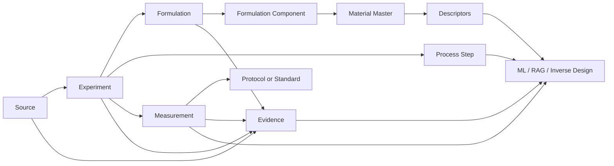

<h1 align="center">Database for PUR</h1>
<p align="center"><strong>面向 PU / PUR / HMPUR 研究的可追溯结构化知识库</strong></p>
<p align="center">将论文、学位论文、专利、标准与工业资料中的 PUR 数据整理为可检索、可追溯、可建模的科研数据库。</p>
<p align="center"><a href="README.md">English</a> · <strong>简体中文</strong></p>

<p align="center">
  
</p>

<p align="center">
  <a href="data/materials/BATCH_005.md"></a>
  <a href="schema/pur_cn_v1.sql"></a>
  
  
</p>

<p align="center">
  <a href="#overview-cn">项目简介</a> ·
  <a href="#data-cn">数据概览</a> ·
  <a href="#model-cn">数据模型</a> ·
  <a href="#research-cn">研究重点</a> ·
  <a href="#quickstart-cn">快速开始</a> ·
  <a href="#roadmap-cn">路线图</a>
</p>

---

<a id="overview-cn"></a>
## 项目简介

`Database-For-PUR` 是一个面向 **polyurethane 与 reactive polyurethane hot-melt adhesive（PUR/HMPUR）** 的结构化科研数据库。

项目将不同来源的数据整理到实验层级：

**Source → Experiment → Formulation → Material → Process → Measurement → Standard → Evidence**

主要用途包括：

- PUR 配方与工艺规律挖掘；
- SQL / FTS / 向量检索；
- property prediction；
- formulation screening；
- inverse design；
- evidence-grounded scientific agents。

---

<a id="data-cn"></a>
## 数据概览

### Legacy HMPUR 云端底座

现有 HMPUR 数据库包含：

| 数据层 | 记录数 |
|---|---:|
| Sources | **21** |
| Standardized formulations | **85** |
| Formulation components | **278** |
| Property / performance observations | **547** |
| Experimental protocols | **22** |
| Temperature-viscosity points | **4,559** |
| Descriptor records | **1,599** |
| PU Tg ML samples | **226** |

其中温度–黏度数据对应 **39 条独立 PU prepolymer viscosity curves**，覆盖约 40–80 °C。库存摘要见 [`data/legacy/cloud_inventory.csv`](data/legacy/cloud_inventory.csv)。

### 中文结构化子库 — Batch 004

| 数据层 | 记录数 |
|---|---:|
| Chinese sources | **36** |
| Experiments | **42** |
| Formulations | **41** |
| Formulation components | **252** |
| Process steps | **137** |
| Measurements | **131** |
| Protocol records | **29** |
| Evidence records | **58** |
| CN patents | **10** |
| MSc thesis index | **10** |
| Chinese standards | **8** |

<p align="center">
  
</p>

<p align="center">
  
</p>

### Batch 005：原料描述符层

Batch 005 开始把数据库从“配方—性能”扩展到 **原料 → 反应 → 性能**：

- Evonik DYNACOLL 7000 polyester-polyol descriptors；
- DYNACOLL + 4,4′-MDI controlled RHM benchmark，OH:NCO = 1:2.2；
- Covestro Desmophen polyol descriptors；
- BASF Lupranate MDI / MDI-prepolymer descriptors；
- Stepan reactive hot-melt adhesive polyester polyols。

详见 [`data/materials/BATCH_005.md`](data/materials/BATCH_005.md)。

---

<a id="model-cn"></a>
## 数据模型



核心表包括 `sources`、`experiments`、`materials`、`formulations`、`formulation_components`、`process_steps`、`measurements`、`protocols`、`evidence`、`viscosity_curves`、`thesis_index` 和 `standard_index`。

---

<a id="research-cn"></a>
## 研究重点

### Polyol blend → MDI prepolymer amplification

当前 HMPUR 研究的核心假设之一：

> 多元醇共混物层面的微小性质差异，在进入 MDI 预聚物阶段后可能被系统性放大，而放大程度本身受 blend composition 调制。

<p align="center">
  
</p>

重点变量包括 `blend viscosity`、`prepolymer viscosity`、`NCO/OH`、`free NCO`、`OH value`、`acid value`、`Mn`、`polyol chemistry`、`reaction temperature`、`reaction time`、`DSC/crystallization`、`open time`、`green strength`、`peel` 与 `lap shear`。

### 真实 composition-property 连续序列

<p align="center">
  
</p>

在 `CN_JRN_WANG2026_PAE` 中，PAE 从 **0 增至 10 wt.%** 时，melt viscosity 从 **1292 增至 4821 mPa·s**，NCO 从 **3.372 降至 2.411 wt.%**，open time 从 **4.5 增至 11.3 min**。

### Mixing-law closure

```math
X_{blend} \rightarrow X_{prepolymer} \rightarrow Y_{adhesive}
```

```math
A = \frac{\Delta \eta_{prepolymer}}{\Delta \eta_{blend}}
```

### Evidence-constrained inverse design

```text
Target properties
        ↓
Material + composition + process descriptors
        ↓
Candidate ranking
        ↓
Experimentally testable PUR formulations
```

---

## 仓库结构

```text
Database-For-PUR/
├── README.md
├── README.zh-CN.md
├── assets/
├── data/
│   ├── cn/
│   ├── legacy/
│   ├── materials/
│   └── master/
├── schema/
│   └── pur_cn_v1.sql
├── scripts/
│   ├── build_database.py
│   └── validate_database.py
└── releases/
```

---

<a id="quickstart-cn"></a>
## 快速开始

当前 builder 用于重建 **core v1 database**，会读取已提交的 legacy metadata、最新可用的中文 cumulative release，以及透明的 source delta 文件。

```bash
git clone https://github.com/stloendays/Database-For-PUR.git
cd Database-For-PUR
python scripts/build_database.py --output database/pur_master.db
python scripts/validate_database.py database/pur_master.db
```

Batch 005 原料数据目前以独立 CSV 形式放在 `data/materials/`，正在单独接入统一 schema。

示例查询：

```sql
SELECT source_id, formulation_id, sample_id,
       property_name_normalized, value, unit,
       temperature_c, evidence_type, quality_level
FROM measurements
WHERE property_name_normalized LIKE '%viscosity%'
  AND temperature_c BETWEEN 115 AND 125
ORDER BY value;
```

---

<a id="roadmap-cn"></a>
## 路线图

- [x] Legacy HMPUR inventory 与迁移底座
- [x] PUR-CN relational schema
- [x] 中文专利 seed corpus
- [x] 中文期刊定量数据整理
- [x] MSc thesis index
- [x] 中文测试标准层
- [x] Raw-material Batch 005 seed
- [ ] 完整迁移 4,559 个 legacy viscosity points
- [ ] 将 Batch 005 material tables 接入统一 schema
- [ ] 继续补充可获取的 thesis 数据
- [ ] 统一 material descriptor layer
- [ ] Hybrid retrieval 与 ML-ready export
- [ ] Blend → prepolymer amplification dataset
- [ ] Evidence-constrained inverse-design benchmark

---

<p align="center"><a href="README.md">English</a> · <strong>简体中文</strong></p>
<p align="center"><strong>Database-For-PUR</strong><br><em>From scattered formulation evidence to machine-readable polyurethane design knowledge.</em></p>
