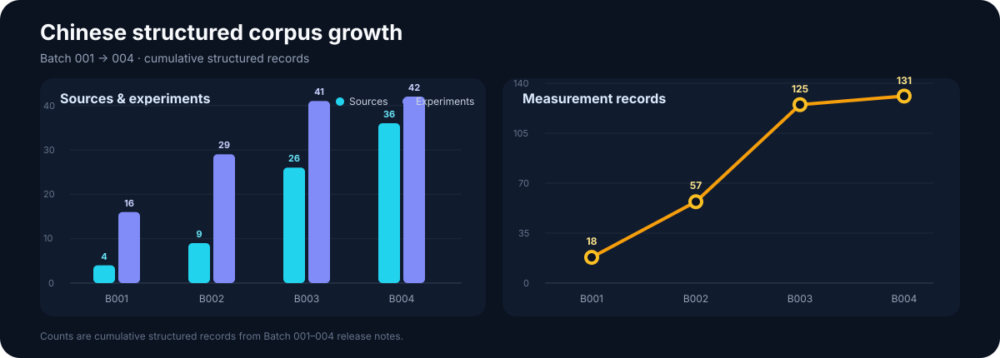
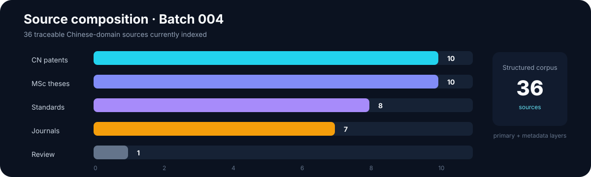
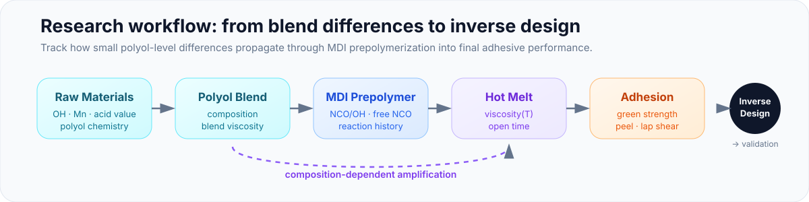
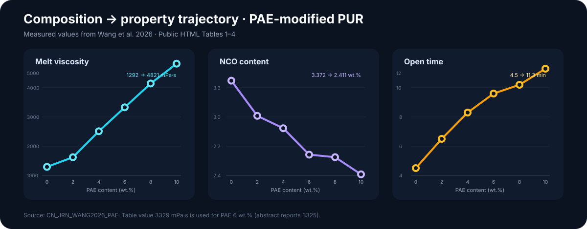

<div align="center">

# Database for PUR

### 面向 PU / PUR / HMPUR 研究的可追溯结构化知识库

**把分散在论文、学位论文、专利、标准与工业资料中的 PUR 数据，转化为可检索、可追溯、可建模的实验级数据库。**

[English](README.md) | **简体中文**

<p align="center">
  
</p>

[](https://github.com/stloendays/Database-For-PUR)
[](data/materials/BATCH_005.md)
[](schema/pur_cn_v1.sql)
[](#rag--agent)
[](#研究重点)
[](https://github.com/stloendays/Database-For-PUR/commits/main)

[项目简介](#项目简介) · [数据概览](#数据概览) · [数据模型](#数据模型) · [研究重点](#研究重点) · [快速开始](#快速开始) · [证据策略](#证据策略) · [路线图](#路线图)

</div>

---

## 项目简介

`Database-For-PUR` 是一个面向 **polyurethane / reactive polyurethane hot-melt adhesive（PUR/HMPUR）** 的结构化科研数据库。

它不是 PDF 收藏夹，也不是简单的文献索引。项目的核心是把公开资料拆解到实验层级：

> **Source → Experiment → Formulation → Material → Process → Measurement → Standard → Evidence**

每一个可用于分析或建模的数值，都应能回答三个问题：

1. **它是什么？** — 物性、单位、测试温度、基材、固化时间等语义明确；
2. **它从哪里来？** — 保留 `source_id`、`evidence_locator`、原始链接与证据等级；
3. **它能不能用于模型？** — measured / claimed / inferred / secondary evidence 严格区分。

主要服务于：PUR 配方与工艺规律挖掘、SQL / FTS / Vector RAG、property prediction、formulation screening、inverse design 和 Agent-based evidence retrieval。

---

## 数据概览

### Legacy HMPUR 云端底座

旧云端 HMPUR SQLite 已确认包含：

| 数据层 | 记录数 |
|---|---:|
| Sources | **21** |
| Standardized formulations | **85** |
| Formulation components | **278** |
| Property / performance observations | **547** |
| Experimental protocols | **22** |
| Temperature–viscosity points | **4,559** |
| Descriptor records | **1,599** |
| PU Tg ML samples | **226** |

其中 4,559 个温度–黏度点对应 **39 条独立 PU prepolymer viscosity curves**，覆盖约 40–80 °C、多个 polyol / isocyanate code 与 pNCO 4–10 wt.% 区间。旧库库存已显式记录在 [`data/legacy/cloud_inventory.csv`](data/legacy/cloud_inventory.csv)。

### 中文结构化子库 — Batch 004

| 数据层 | 记录数 |
|---|---:|
| Chinese sources | **36** |
| Experiments | **42** |
| Formulations | **41** |
| Formulation components | **252** |
| Process steps | **137** |
| Measurements | **131** |
| Protocol records | **29** |
| Evidence records | **58** |
| CN patents | **10** |
| MSc thesis index | **10** |
| Chinese standards | **8** |

> 详见 [`data/cn/BATCH_004.md`](data/cn/BATCH_004.md)

### 数据增长

<p align="center">
  
</p>

Batch 001 → 004 中，中文结构化子库由 **4 → 36 sources**、**16 → 42 experiments**、**18 → 131 measurements**。

### 来源构成

<p align="center">
  
</p>

当前 36 个中文域来源由 **10 个 CN patent、10 篇硕士论文、8 个标准、7 篇期刊论文和 1 条综述型二手来源**组成。不同来源类型不等权：标准、metadata、secondary evidence 主要用于测试语义、RAG 与约束，不默认作为主训练观测。

### Batch 005：原料描述符层

Batch 005 开始把数据库从“配方—性能”进一步连接到“原料描述符—反应—性能”。目前已加入：

- **Evonik DYNACOLL 7000**：21 个 polyester-polyol grades 的 OH、acid、MW、Tg、Tm、softening point、density、melt viscosity；
- **DYNACOLL + 4,4′-MDI controlled RHM benchmark**：统一 OH:NCO = 1:2.2 条件下的 open time、setting time、tensile、elongation、130 °C melt viscosity；
- **Covestro Desmophen 2002 / C 1200**：OH、acid、water、viscosity、equivalent weight 等；
- **BASF Lupranate**：monomeric / modified / polymeric MDI 与 MDI prepolymer 的 NCO、functionality、25 °C viscosity；
- **Stepan polyester polyols**：多款明确用于 reactive hot-melt adhesive 的 polyester polyol grades。

详见 [`data/materials/BATCH_005.md`](data/materials/BATCH_005.md)。

---

## 数据模型


### 核心表

| Table | 作用 |
|---|---|
| `sources` | 论文、专利、学位论文、标准、TDS/SDS、报告等来源 |
| `experiments` | 一篇来源内部的 sample / example / comparative example |
| `materials` | 原料主表与标准化材料实体 |
| `formulations` | 配方级记录 |
| `formulation_components` | component-level 配方组成 |
| `process_steps` | 脱水、加料、预聚、扩链、真空脱泡等工艺步骤 |
| `measurements` | 黏度、NCO、open time、peel、lap shear、DSC 等观测值 |
| `protocols` | 测试方法、条件与标准 |
| `standard_index` | GB / HG/T 等标准索引 |
| `evidence` | 原始证据定位、证据类型与可信度 |
| `viscosity_curves` | 温度–黏度曲线点 |
| `thesis_index` | 中文硕博论文追踪与全文状态 |
| `rag_fts` | SQLite FTS5 全文检索入口 |

---

## 研究重点

### 1. Polyol blend → MDI prepolymer amplification

数据库重点支持当前 HMPUR 研究假设：

> **多元醇共混物层面的微小性质差异，在进入 MDI 预聚物阶段后可能被系统性放大，而放大程度本身受 blend composition 调制。**

<p align="center">
  
</p>

优先变量包括：`blend viscosity` · `prepolymer viscosity` · `NCO/OH` · `free NCO` · `OH value` · `acid value` · `Mn` · `polyol chemistry` · `reaction temperature` · `reaction time` · `DSC/crystallization` · `open time` · `green strength` · `peel` · `lap shear`。

### 真实 composition–property 连续序列

<p align="center">
  
</p>

以 `CN_JRN_WANG2026_PAE` 为例，PAE 从 **0 → 10 wt.%** 时，melt viscosity 由 **1292 → 4821 mPa·s**，NCO 由 **3.372 → 2.411 wt.%**，open time 由 **4.5 → 11.3 min**。这类连续序列比单个 optimum formulation 更适合训练和验证 composition-aware 模型。

### 2. Mixing-law failure

数据库用于检验简单加性混合律是否能够闭合：

$$
X_{blend} \rightarrow X_{prepolymer} \rightarrow Y_{adhesive}
$$

并研究 composition-dependent amplification：

$$
A = \frac{\Delta \eta_{prepolymer}}{\Delta \eta_{blend}}
$$

### 3. Evidence-constrained inverse design

```text
Target properties
    ↓
Evidence-filtered formulation space
    ↓
Material + composition + process descriptors
    ↓
Candidate ranking
    ↓
Experimentally testable PUR formulations
```

---

## 收集范围

- 中文 / 英文期刊论文、硕博论文、会议技术资料；
- CN / WO / US / EP patents，区分 example / comparative example / claimed range；
- GB / HG/T 等胶黏剂测试标准；
- polyester / polyether / polycarbonate polyol TDS；
- MDI grades、tackifier、acrylic resin、catalyst、silane；
- 可合法再分发的开放数据集与工业资料。

本仓库默认**不公开上传受版权保护的论文或学位论文全文**，只公开结构化事实、元数据、来源链接、短证据定位与合法开放资料。

---

## 仓库结构

```text
Database-For-PUR/
│
├── assets/                     # README 科研图与数据图
├── data/
│   ├── cn/                     # 中文结构化来源
│   ├── legacy/                 # 旧 HMPUR 云端数据与迁移索引
│   ├── materials/              # Batch 005 原料描述符层
│   ├── master/                 # terminology / material normalization
│   └── rag/                    # RAG-ready evidence units
├── schema/
│   └── pur_cn_v1.sql
├── scripts/
│   ├── build_database.py
│   └── validate_database.py
└── releases/
    └── cn_seed_batch_*.zip
```

---

## 快速开始

```bash
git clone https://github.com/stloendays/Database-For-PUR.git
cd Database-For-PUR
python scripts/build_database.py --output database/pur_master.db
python scripts/validate_database.py database/pur_master.db
```

示例：查询约 120 °C 的 PUR 黏度记录：

```sql
SELECT source_id, formulation_id, sample_id,
       property_name_normalized, value, unit,
       temperature_c, evidence_type, quality_level
FROM measurements
WHERE property_name_normalized LIKE '%viscosity%'
  AND temperature_c BETWEEN 115 AND 125
ORDER BY value;
```

---

## RAG / Agent


Agent 输出候选配方或数值时，至少应返回：`source_id`、`experiment_id`、`formulation_id`、property/value/unit、measurement condition、`evidence_type`、`quality_level`、`evidence_locator` 和 `source_url`。

---

## 证据策略

| Level | 定义 | 默认建模用途 |
|---|---|---|
| **A** | 完整配方 + 工艺 + 测试条件 + 定量结果 + 原始证据定位 | ✅ preferred |
| **B** | 配方和定量结果可靠，但部分工艺/测试条件缺失 | ✅ usable with caution |
| **C** | 部分配方、范围、二手报道或间接信息 | ⚠️ RAG / weak supervision |
| **D** | 综述、背景资料、宣传资料 | ❌ not primary training data |

Evidence type 包括：

`measured` / `example` / `comparative_example` / `reported` / `claimed_range` / `recommended_range` / `digitized_from_figure` / `inferred` / `secondary_reported`

关键规则：

- Missing / not disclosed **≠ 0**；
- 原始值与标准化值同时保留；
- 测试温度、时间、基材、固化时间属于 measurement semantics；
- patent claimed range 不得伪装成 measured example；
- 厂家 specification 不伪装成独立实验测量；
- 二手引用不升级为原论文实验数据；
- 图片表格无法可靠读取时，不为了增加 row count 猜数。

---

## 路线图

- [x] Legacy HMPUR database inventory & migration base
- [x] PUR-CN relational schema
- [x] Chinese patent seed corpus
- [x] Quantitative Chinese journal extraction
- [x] MSc thesis index
- [x] Chinese test-standard layer
- [x] Raw-material Batch 005 seed: polyols / MDI / controlled RHM benchmark
- [ ] Full 4,559-point legacy viscosity migration
- [ ] Full thesis extraction where legally accessible
- [ ] Unified material descriptor layer
- [ ] Automated FTS + vector hybrid retrieval
- [ ] ML-ready export pipeline
- [ ] Blend → prepolymer amplification dataset
- [ ] Evidence-constrained inverse-design benchmark

---

<div align="center">

[English](README.md) | **简体中文**

**Database-For-PUR**  
*From scattered formulation evidence to machine-readable polyurethane design knowledge.*

</div>
